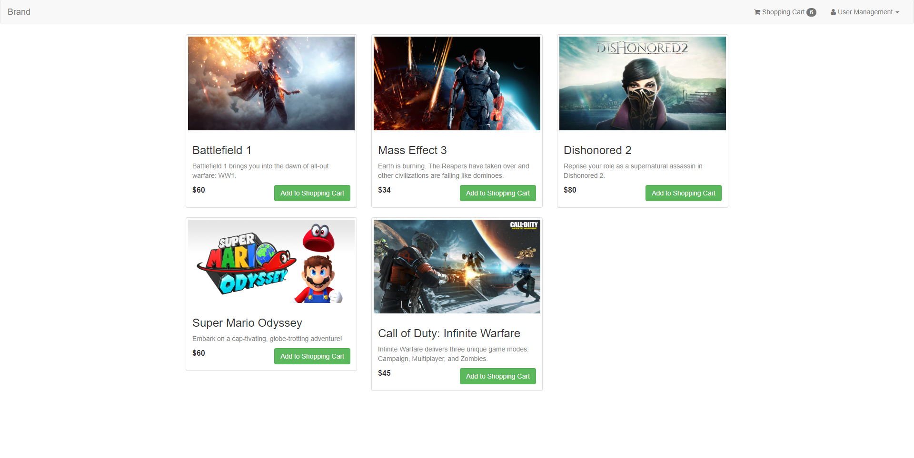
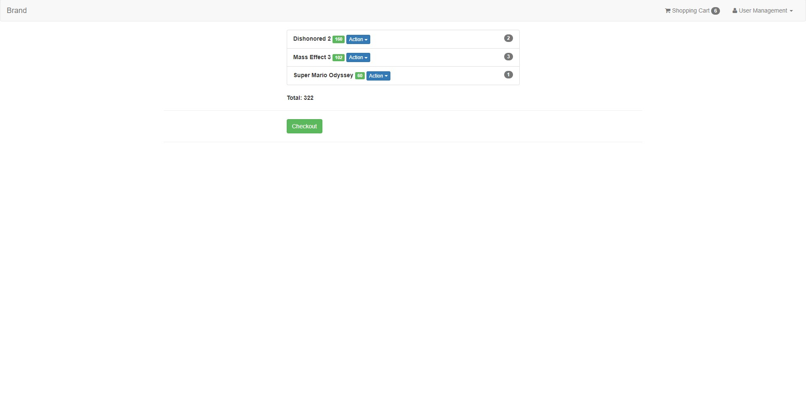

# Shopping Cart • NodeJS

This development project uses **NodeJS** Back-end technology to build a conceptual online shopping experience. **MongoDB** database management helps users by view products fast and manage their cart smoothly. **Stripe** online payment makes checkouts quick and effortless. **OAuth** session handling provides hassle-free profile managing for users.

## Landing Page

## Cart Items

